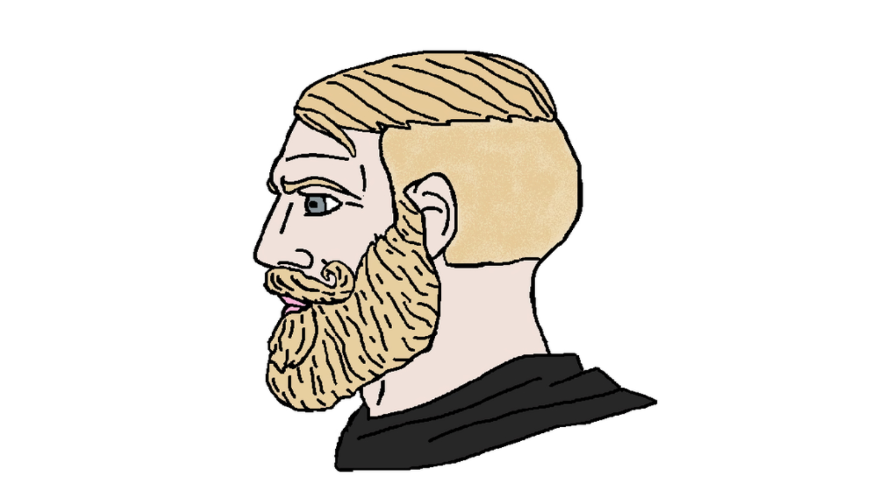

# YoBig

<!-- PROJECT LOGO -->

Friendly Discord bot that let's you play audio files and other cool stuff on your discord server.

<!-- TABLE OF CONTENTS -->
## Table of Contents

* [Getting Started](#getting-started)
  * [Installation](#installation)
* [Projects](#projects)

## Getting Started

### Installation

There are multiple projects inside this repo. Be sure to follow these steps and add the required environment variable for each project.

#### Steps

1. Clone or download the repo : ``git clone https://github.com/GeorgesMainville/YoBig.git``

2. Install npm dependencies : ``npm install``

3. Ask a contributor to give the environment variables for the desired project.

## Projects

This is the list of all the projects inside the repo linking to the README of each projects.

1. [YoBig Bot](./Bot/README.md)

2. [YoBig Web application](./WebApp/README.md)
